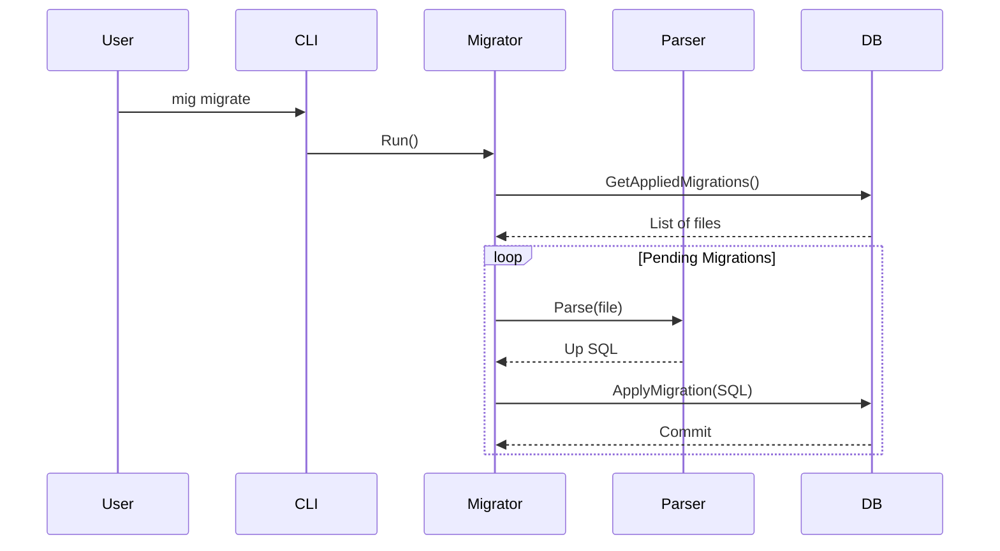

# Architecture Overview

## Design Philosophy
- **Language Agnostic:** The core engine is decoupled from specific migration file formats (SQL, YAML, JSON).
- **Driver-Based:** Database operations are abstracted through a `Driver` interface, supporting PostgreSQL, MySQL, and SQLite.
- **Config-First:** Operations are controlled via `mig.yml` and environment variables.

## System Architecture

```mermaid
graph TD
    CLI[CLI (cobra)] --> Config[Config Loader]
    CLI --> Migrate[Migrate Orchestrator]
    
    subgraph "Internal Logic"
        Migrate --> DriverInterface[Driver Interface]
        Migrate --> ParserInterface[Parser Interface]
    end
    
    Config -.-> DriverInterface
    Config -.-> ParserInterface
    
    subgraph "Drivers"
        Postgres[PostgreSQL]
        MySQL[MySQL]
        SQLite[SQLite]
    end
    
    DriverInterface <|-- Postgres
    DriverInterface <|-- MySQL
    DriverInterface <|-- SQLite
    
    subgraph "Parsers"
        SQLP[SQL Parser]
        FutureP[YAML/JSON Parser]
    end
    
    ParserInterface <|-- SQLP
    ParserInterface <|-- FutureP
```

## Migration Execution Flow



## Module Responsibilities
- **`cmd/mig/`**: CLI entry point (using `cobra`) and setup/onboarding interactive logic.
- **`internal/config`**: Loads `mig.yml` and merges with environment variables.
- **`internal/db`**: Driver interfaces and implementations for PostgreSQL, MySQL, and SQLite.
- **`internal/migrate`**: Orchestrates migration lifecycle (migrate, rollback, reset, status).
- **`internal/parser`**: Handles migration file parsing (via `Parser` interface).

## Deployment Pipeline
Mig uses a custom CI/CD pipeline built with GitHub Actions and **nfpm**:
1. **Cross-Compilation**: Binaries are built for multiple architectures (amd64, arm64).
2. **Native Packaging**: `nfpm` generates `.deb` and `.rpm` packages.
3. **Distribution**: Packages are pushed to **Cloudsmith** for native package manager support (`apt`/`dnf`) and uploaded to GitHub Releases.

## Database Tracking
Migrations are tracked via an `_migrations` table in the target database with:
- `uuid` (Primary Key, auto-generated)
- `migration` (Name of the migration file)
- `batch` (Used for bulk rollback tracking)

## Extensibility
- **New Drivers:** Implement the `db.Driver` interface in `internal/db` and add to `factory.go`.
- **New Parsers:** Implement the `parser.Parser` interface in `internal/parser` and add to the `getParser` logic in `cmd/mig/`.
